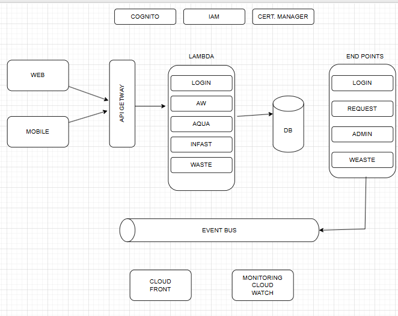
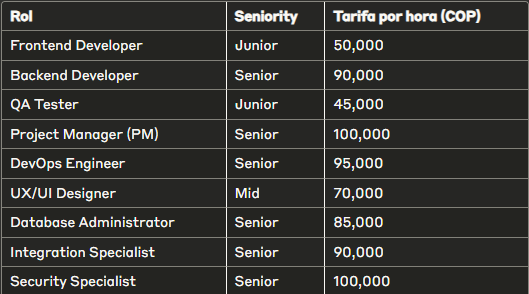
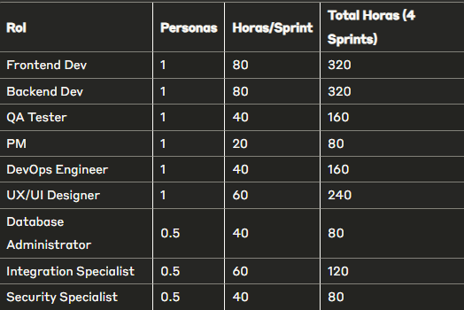
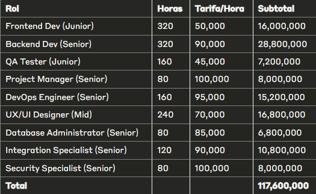
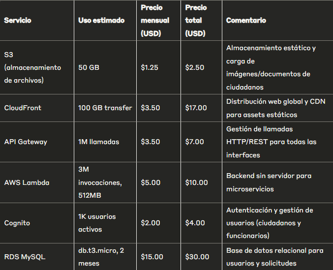
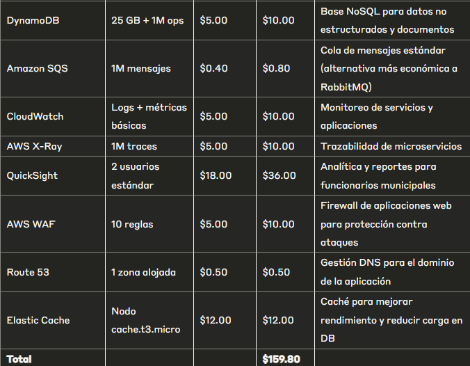

# Planning_Budgeting

## 📐 High-Level Design Document
A metaphor system architecture diagram with clear modular components (frontend, backend, database, third-party services).
A text explaining the architecture.

### Architecture Diagram

## 🗂️ Agile Product Backlog
A prioritized list of epics and user stories, organized using user story mapping.
Use Story Points.
### Epics

## 💰 Development Budget
Estimate the cost of implementation based on team roles (e.g., frontend/backend devs, QA, PM), hourly rates, and effort
(story points or ideal days).
Present the budget in a simple table with assumptions and ranges.

### Budget Table
#### Supuestos para el cálculo

#### Cálculo del esfuerzo por rol

Los roles con dedicación parcial (0.5) representan recursos compartidos con otros proyectos o consultores contratados
por tiempo limitado.

#### Presupuesto de desarrollo (COP)

#### Presupuesto de Servicios Cloud

